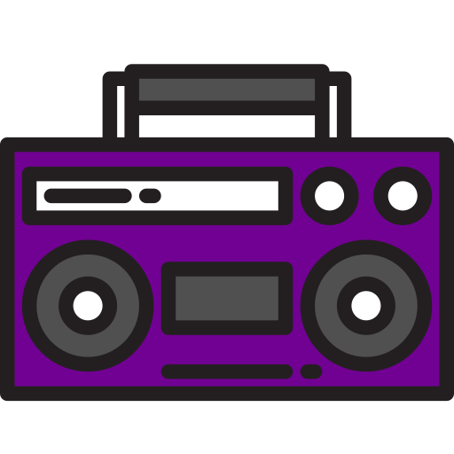

<div align="center">
  

  # Boombox

  ### *The music never stops*

  A personal, self-hosted music player — Angular 19 web client.

  
  
  
  
</div>

<br/>

> **Solo, self-hosted project.** Built to control one person's own music library, not a general-purpose
> product — not accepting external contributions, but documented here in the interest of sharing how it's built.

It's the browser-based control surface for the [`boombox.services.musicplayer`](../boombox.services.musicplayer)
backend — the library grid, the player, playlists, lyrics, and settings, all driven live over SignalR rather
than a traditional REST request/response cycle.

## Screenshots

<table>
  <tr>
    <td align="center" width="33%">
      <br/>
      <sub><b>Library</b> — album grid, search, sort, per-library counts</sub>
    </td>
    <td align="center" width="33%">
      <br/>
      <sub><b>Album</b> — track list, metadata, Play All / Shuffle / Add To</sub>
    </td>
    <td align="center" width="33%">
      <br/>
      <sub><b>Queue actions</b> — Prepend/Append into the live queue</sub>
    </td>
  </tr>
  <tr>
    <td align="center" width="33%">
      <br/>
      <sub><b>Equalizer</b> — live 9-band preset editing</sub>
    </td>
    <td align="center" width="33%">
      <br/>
      <sub><b>Lyrics</b> — synced line highlighting over now-playing</sub>
    </td>
    <td align="center" width="33%">
      <br/>
      <sub><b>Mapping Statistics</b> — cache-load vs. full-scan history</sub>
    </td>
  </tr>
  <tr>
    <td align="center" width="33%">
      <br/>
      <sub><b>Equalizer presets</b> — Settings tab</sub>
    </td>
    <td align="center" width="33%">
      <br/>
      <sub><b>Loading state</b></sub>
    </td>
    <td align="center" width="33%">
      <br/>
      <sub><b>Track loading state</b></sub>
    </td>
  </tr>
</table>

## What it does

- **Library** — browse a mapped music collection as an album grid, search and sort by name/favourites/play
  count, and open an album to see and play its tracks.
- **Player** — a persistent mini-player in the sidebar plus a full now-playing view: transport controls,
  playback modes (sequential/shuffle/repeat), a live now-playing queue with reorder/remove, a 9-band equalizer
  (named presets and per-track overrides), and synced lyrics with Apple Music-style line highlighting.
- **Playlists** — the "Favourite" playlist, and a live "Now Playing" view built from whatever's actually queued
  on the backend.
- **Settings** — output device selection (with live availability grey-out if a device disappears), equalizer
  preset management, and a mapping-statistics history view (bar charts of full-scan vs. cache-load run
  durations over time).
- **Server controls** — remote start/stop/restart of the backend service itself, and a live connection/version
  indicator.

## Tech stack

- **Angular 19** (standalone components, no NgModules)
- **`@microsoft/signalr`** — five persistent hub connections (library, player, playlist, server, and
  auto-scroll state), each wrapped in its own Angular service exposing RxJS observables
- **`ng2-charts`** (Chart.js) — the mapping-statistics bar charts
- **`@ngneat/svg-icon`** — the app's icon set
- **Angular Material CDK** — used selectively, not as the primary UI kit (the app's visual design is custom)

Nothing in the state layer uses `localStorage`/`sessionStorage` — everything that needs to persist across a
reload (selected album, library scroll position) is server-side, via Redis behind the backend's `LibraryHub`/
`AutoScrollHub`.

## Project structure

```
src/app/
  components/     — one folder per feature area: album, library, player, playlist, modal, search-bar,
                    settings, sidebar, snackbar, progress-bar, main
  services/       — one service per SignalR hub, plus cross-cutting services (modal, snackbar)
```

Each component folder generally holds its own nested sub-components (e.g. `player/components/equalizer`,
`player/components/lyrics`) rather than a flat structure — a feature and everything specific to it stays
together.

## How it talks to the backend

The app opens five separate SignalR connections, one per backend hub (`LibraryHub`, `PlayerHub`,
`PlaylistHub`, `ServerHub`, `AutoScrollHub`), each addressed by a fixed URL in `src/environments/environment.ts`.
There's no REST layer for application data — reads, writes, and live push updates all go through these hub
connections; the only plain HTTP calls in the app are the three remote server-control endpoints (start/stop/
restart), which front a Windows Task Scheduler mechanism entirely outside this codebase.

For the full picture of how the backend that powers this UI actually works — the playback engine, library
mapping, the SignalR broadcast architecture, and where each of this UI's features gets its data — see the
[`boombox.docs`](../boombox.docs) repository, in particular
[Real-time sync / broadcast architecture](../boombox.docs/features/05-realtime-sync/) and
[Frontend UI shell](../boombox.docs/features/06-frontend-ui-shell/).

## Running it

This UI expects the [backend](../boombox.services.musicplayer) to already be running and reachable at the hub
URLs configured in `src/environments/environment.ts` — by default `http://localhost:7280/*`. In this project's
real deployment that "localhost" is bridged over Tailscale to a separate Windows machine (see
[Deployment & infrastructure](../boombox.docs/features/08-deployment/deployment-topology.md)); for local
development, point those URLs at wherever your own `MusicServer` instance is listening.

```
npm install
ng serve
```

Navigate to `http://localhost:4200/`. The production build (`ng build`) is containerized via the included
`Dockerfile`/`nginx.conf` — see [Deployment & infrastructure](../boombox.docs/features/08-deployment/) for how
this app is actually hosted (Proxmox + Docker + LXC) alongside the Windows-hosted backend.
